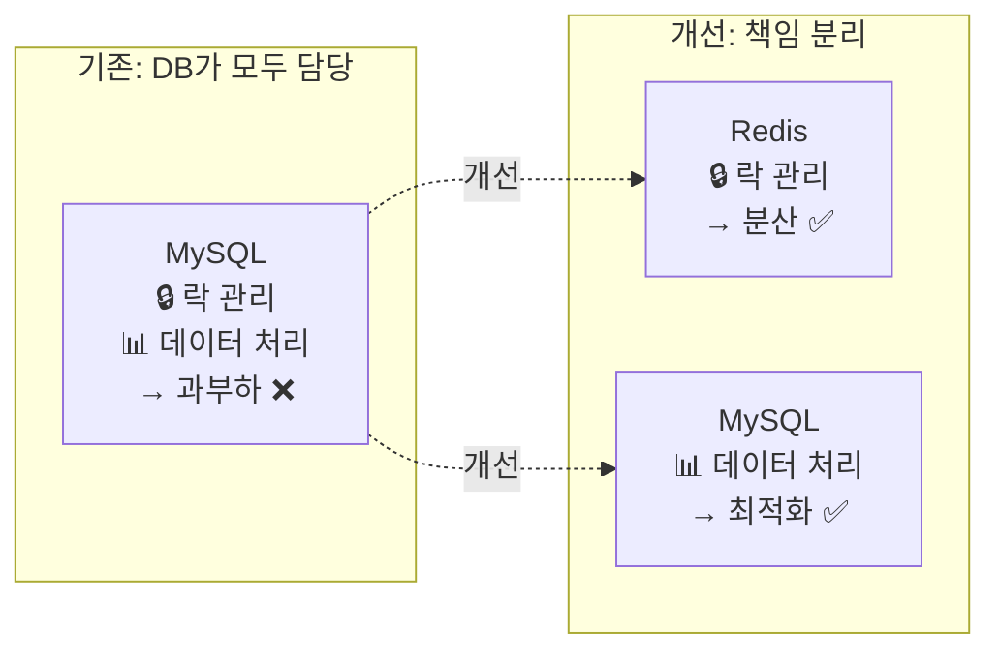
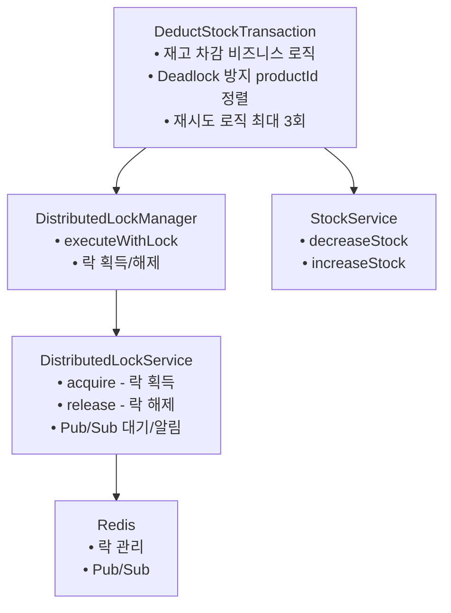

# Redis 분산락(Distributed Lock) 학습 보고서

## 목표

분산 환경에서 동시성을 제어하기 위해 Redis 기반 분산락을 이해하고 직접 구현해본다.

## 학습 키워드

- Distributed Lock (Redis)
- Simple Lock, Spin Lock, Pub/Sub Lock
- 락과 트랜잭션 순서 보장

## To-Do

- [x] Redis 기반 Simple Lock 직접 구현
- [x] 락-트랜잭션 순서 문제 사례 정리
- [x] Pub/Sub 기반 락 구조 이해
- [x] TestContainers를 활용한 통합 테스트 작성

## 세팅

| 언어       | 분산락 구현 방식                 |
| ---------- | -------------------------------- |
| TypeScript | ioredis 라이브러리로 분산락 구현 |

---

## 1. 배경: 재고 동시성 문제

### 문제 상황

전자상거래 시스템에서 여러 사용자가 동시에 같은 상품을 주문할 때 **재고 동시성 문제**(Race Condition)가 발생합니다.

**예시:**

- 초기 재고: 10개
- 10명이 동시에 1개씩 주문
- 예상 결과: 재고 0개
- 실제 결과: 재고 9개 또는 그 이상 (재고 손실 발생)

### 심각성

- 재고 10개에 100명이 동시 주문 시 → 재고가 음수가 될 수 있음
- 실제 재고보다 더 많이 판매되는 치명적 버그
- 비즈니스 손실 직결

---

## 2. 해결 과정

### 2.1. 1차 시도: DB 비관적 락 (SELECT FOR UPDATE)

**방식:**

- MikroORM의 `LockMode.PESSIMISTIC_WRITE` 사용
- 트랜잭션 내에서 재고 조회 시 행 단위 락 획득

**문제점:**

| 문제                 | 설명                                                       |
| -------------------- | ---------------------------------------------------------- |
| **분산 환경 미지원** | DB 샤딩 또는 여러 DB 인스턴스 사용 시 락이 독립적으로 동작 |
| **DB 부하 집중**     | 락 관리, 대기 큐, 데드락 감지 등 모든 작업을 DB가 처리     |
| **긴 트랜잭션**      | 락 대기 시간이 트랜잭션 시간에 포함되어 다른 쿼리도 블로킹 |
| **커넥션 고갈**      | 락 대기 중에도 커넥션을 점유하여 커넥션 풀 부족 발생       |
| **수동적 대기**      | DB 엔진이 내부적으로 폴링하는 방식으로 비효율적            |

**결론:** 실제 운영 환경(Scale-out, 분산 DB)에 적용하기 어려움

### 2.2. 2차 해결: Redis 분산락 도입

**핵심 아이디어: 책임 분리**



**장점:**

1. ✅ **분산 환경 지원**: 중앙 집중식 락으로 여러 서버에서 동일한 락 공유
2. ✅ **DB 부하 감소**: 락 관리를 Redis로 분리하여 DB는 데이터 처리만 담당
3. ✅ **트랜잭션 시간 단축**: 락 대기를 DB 밖에서 처리하여 트랜잭션 시간 최소화
4. ✅ **커넥션 효율**: 락 획득 후에만 DB 접근하여 커넥션 재사용
5. ✅ **Pub/Sub 알림**: 이벤트 기반으로 락 해제 즉시 알림

---

## 3. 구현 방식

### 3.1. 아키텍처



### 3.2. 주요 구현 파일

#### 분산락 서비스

| 파일                                                  | 설명                   | 주요 기능                                                                                                                                 |
| ----------------------------------------------------- | ---------------------- | ----------------------------------------------------------------------------------------------------------------------------------------- |
| `src/common/lock/distributed-lock.service.ts`         | Redis 분산락 핵심 로직 | -`acquire()`: 락 획득 (Pub/Sub 대기)`<br>`- `release()`: 락 해제 (알림 발행)`<br>`- SET NX PX 명령 사용`<br>`- Lua 스크립트로 원자성 보장 |
| `src/common/lock/distributed-lock-manager.service.ts` | 분산락 매니저          | -`executeWithLock()`: 락 하에서 함수 실행`<br>`- finally로 락 해제 보장                                                                   |
| `src/common/lock/lock.module.ts`                      | 분산락 모듈            | - 의존성 주입 설정                                                                                                                        |

#### 비즈니스 로직

| 파일                                                                    | 설명               | 주요 기능                                                                                  |
| ----------------------------------------------------------------------- | ------------------ | ------------------------------------------------------------------------------------------ |
| `src/modules/product/application/in-domain/deduct-stock.transaction.ts` | 재고 차감 트랜잭션 | - productId 정렬로 Deadlock 방지`<br>`- 재시도 로직 (최대 3회)`<br>`- 부분 성공 허용       |
| `src/modules/product/domain/service/stock.service.ts`                   | 재고 서비스        | -`decreaseStock()`: 재고 감소`<br>`- `increaseStock()`: 재고 증가`<br>`- Repository에 위임 |

#### 테스트

| 파일                                                                                     | 설명        | 주요 테스트                                                                                                    |
| ---------------------------------------------------------------------------------------- | ----------- | -------------------------------------------------------------------------------------------------------------- |
| `src/modules/product/application/in-domain/deduct-stock.transaction.integration.spec.ts` | 통합 테스트 | - 동시 재고 차감 테스트`<br>`- 재고 부족 시 실패 테스트`<br>`- Deadlock 방지 테스트`<br>`- TestContainers 사용 |

### 3.3. 핵심 기술

#### Redis SET NX PX

```typescript
// SET lock:stock:product-123 "uuid-123" PX 5000 NX
// - NX: 키가 없을 때만 설정 (Not eXists)
// - PX 5000: 5초 후 자동 삭제 (TTL)
// 파일 위치: src/common/lock/distributed-lock.service.ts:142-151
```

#### Lua 스크립트 (원자성 보장)

```lua
-- 락 해제 + Pub/Sub 알림을 원자적으로 실행
-- Redis는 단일 스레드라 Lua 스크립트는 원자적으로 실행됨
-- 파일 위치: src/common/lock/distributed-lock.service.ts:99-107
```

#### Pub/Sub 기반 대기

```
클라이언트 1: 락 획득
클라이언트 2~100: 채널 구독 + 대기 (CPU 사용 없음)
클라이언트 1: 락 해제 → Pub/Sub 알림 발행
클라이언트 2~100: 즉시 알림 받고 락 획득 시도

파일 위치: src/common/lock/distributed-lock.service.ts:164-185
```

#### 재시도 로직

```typescript
// DeductStockTransaction
// - 최대 3회 재시도
// - 100ms 대기 후 재시도
// - InsufficientStockException은 재시도 불필요 → 즉시 실패
// 파일 위치: src/modules/product/application/in-domain/deduct-stock.transaction.ts:32-81
```

#### Deadlock 방지

```typescript
// productId로 정렬하여 항상 동일한 순서로 락 획득
// 사용자 A: [상품2, 상품1] → 정렬 후: [상품1, 상품2]
// 사용자 B: [상품1, 상품2] → 정렬 후: [상품1, 상품2]
// → 동일한 순서로 락 획득 → Deadlock 없음
// 파일 위치: src/modules/product/application/in-domain/deduct-stock.transaction.ts:35-38
```

---

## 4. 테스트 결과

### 4.1. 테스트 환경

- **TestContainers**: MySQL + Redis 실제 컨테이너 사용
- **동시 요청**: `Promise.all`로 실제 동시성 시뮬레이션
- **테스트 도구**: Jest

### 4.2. 테스트 케이스

#### 테스트 1: 재고 10개, 10명 동시 주문

```
Given: 재고 10개인 상품
When: 10명이 동시에 1개씩 주문
Then:
  - 10명 모두 성공
  - 최종 재고: 0개 (정확)
  - Race condition 없음 ✅
```

**파일 위치:** `src/modules/product/application/in-domain/deduct-stock.transaction.integration.spec.ts:69-117`

#### 테스트 2: 재고 5개, 10명 동시 주문

```
Given: 재고 5개인 상품
When: 10명이 동시에 1개씩 주문
Then:
  - 5명 성공, 5명 실패
  - 최종 재고: 0개 (음수 안 됨)
  - 재고 부족 시 적절히 실패 ✅
```

**파일 위치:** `src/modules/product/application/in-domain/deduct-stock.transaction.integration.spec.ts:119-188`

#### 테스트 3: 여러 상품 동시 차감 (Deadlock 테스트)

```
Given: 상품 2개 (각각 재고 10개)
When: 10명이 서로 다른 순서로 [상품1, 상품2] 주문
Then:
  - 10명 모두 성공 (각각 2개 상품)
  - Deadlock 없음
  - productId 정렬이 효과적으로 작동 ✅
```

**파일 위치:** `src/modules/product/application/in-domain/deduct-stock.transaction.integration.spec.ts:190-272`

---

## 5. 학습 내용 정리

### 5.1. Redis 분산락의 이해

#### Lock 획득/해제 플로우

1. **락 획득 시도** (SET NX PX)
   - 성공: 즉시 반환
   - 실패: Pub/Sub 채널 구독

2. **대기** (Pub/Sub 구독)
   - 락 해제 메시지 대기
   - 타임아웃까지 반복 시도

3. **락 해제** (Lua 스크립트)
   - 락 삭제 + Pub/Sub 알림 발행
   - 원자적으로 실행

4. **알림 수신**
   - 대기 중인 클라이언트가 즉시 락 획득 시도
   - 1명 성공, 나머지는 다시 대기

#### 구현 방식 비교

| 방식             | 설명                                     | 장점              | 단점               | 구현 위치                                        |
| ---------------- | ---------------------------------------- | ----------------- | ------------------ | ------------------------------------------------ |
| **Simple Lock**  | SET NX로 락 획득, 실패 시 즉시 반환      | 간단함            | 재시도 불가        | -                                                |
| **Spin Lock**    | 락 획득 실패 시 일정 시간 대기 후 재시도 | 구현 간단         | CPU 낭비, 비효율적 | -                                                |
| **Pub/Sub Lock** | 락 해제 시 Pub/Sub으로 알림              | 효율적, 즉시 반응 | 구현 복잡          | `src/common/lock/distributed-lock.service.ts` ✅ |

### 5.2. 락과 트랜잭션 순서 보장

#### 잘못된 순서 (락 - 트랜잭션 순서 문제)

```
❌ 문제 상황:
1. DB 트랜잭션 시작
2. Redis 분산락 획득
3. 재고 차감
4. DB 트랜잭션 커밋
5. Redis 락 해제

문제점:
- 락을 잡고 있는데 트랜잭션이 아직 커밋 안 됨
- 다른 요청이 락을 획득해도 이전 변경사항이 반영 안 됨
- 데이터 정합성 깨짐
```

#### 올바른 순서

```
✅ 올바른 구현:
1. Redis 분산락 획득
2. DB 트랜잭션 시작
3. 재고 차감
4. DB 트랜잭션 커밋
5. Redis 락 해제

장점:
- 락 해제 전에 트랜잭션이 완전히 커밋됨
- 다음 요청이 락을 획득하면 변경사항이 확실히 반영됨
- 데이터 정합성 보장
```

**구현 확인:**

- 락 획득: `DistributedLockManager.executeWithLock()` → `src/common/lock/distributed-lock-manager.service.ts:41-52`
- 트랜잭션: `StockRepository.decrease()` 내부에서 `@Transactional()` 처리

### 5.3. 주요 개념

#### TTL (Time To Live)

```
락 획득 시 TTL 설정 (기본 5초)
→ 서버 다운 시 자동으로 락 해제
→ 데드락 방지

파일 위치: src/common/lock/distributed-lock.service.ts:20
```

#### Lua 스크립트의 원자성

```
Redis는 단일 스레드
→ Lua 스크립트는 중간에 끼어들 수 없음
→ 락 삭제 + 알림 발행을 원자적으로 처리

파일 위치: src/common/lock/distributed-lock.service.ts:99-107
```

#### Deadlock 방지 전략

```
항상 동일한 순서로 락 획득
→ productId로 정렬
→ 순환 대기 발생 불가

파일 위치: src/modules/product/application/in-domain/deduct-stock.transaction.ts:35-38
```

---

## 6. 결론

### 6.1. 문제 해결 요약

| 문제                 | 해결 방식                 | 결과                       |
| -------------------- | ------------------------- | -------------------------- |
| **분산 환경 미지원** | Redis 중앙 집중식 락      | ✅ 여러 서버에서 동작      |
| **DB 부하 집중**     | 락 관리를 Redis로 분산    | ✅ DB 부하 대폭 감소       |
| **긴 트랜잭션**      | 락 대기를 DB 밖에서 처리  | ✅ 트랜잭션 시간 대폭 단축 |
| **커넥션 고갈**      | 순차 처리로 커넥션 재사용 | ✅ 커넥션 효율 증가        |
| **수동적 대기**      | Pub/Sub 이벤트 기반 알림  | ✅ 즉시 반응 + CPU 효율    |

### 6.2. 도입 효과

1. **안정성 향상**
   - TTL 자동 해제로 데드락 방지
   - 정렬 전략으로 Deadlock 방지
   - 부분 성공 허용으로 유연한 처리

2. **확장성 확보**
   - Scale-out 환경 지원
   - DB 샤딩 환경 지원
   - MSA 전환 대비

3. **성능 개선**
   - DB 부하 대폭 감소
   - 트랜잭션 시간 대폭 단축
   - 커넥션 효율적 사용

### 6.3. 트레이드오프

**장점:**

- 분산 환경 완벽 지원
- DB 부하 대폭 감소
- 빠른 응답 속도
- 안정적인 동시성 제어

**단점:**

- Redis 인프라 추가 필요
- 구현 복잡도 증가
- 장애 포인트 추가 (Redis 장애 시 영향)

---

## 참고 자료

### 구현 파일

- **분산 락 서비스**: `src/common/lock/distributed-lock.service.ts`
- **분산 락 매니저**: `src/common/lock/distributed-lock-manager.service.ts`
- **재고 차감 트랜잭션**: `src/modules/product/application/in-domain/deduct-stock.transaction.ts`
- **재고 서비스**: `src/modules/product/domain/service/stock.service.ts`
- **통합 테스트**: `src/modules/product/application/in-domain/deduct-stock.transaction.integration.spec.ts`

### 기술 문서

- [Redis SET Command](https://redis.io/commands/set/)
- [Redis Pub/Sub](https://redis.io/docs/manual/pubsub/)
- [Distributed Locks with Redis](https://redis.io/docs/manual/patterns/distributed-locks/)
- [MySQL InnoDB Locking](https://dev.mysql.com/doc/refman/8.0/en/innodb-locking.html)
- [Redlock Algorithm](https://redis.io/docs/manual/patterns/distributed-locks/#the-redlock-algorithm)

---

**작성일**: 2025-11-28
**작성자**: 민지영
