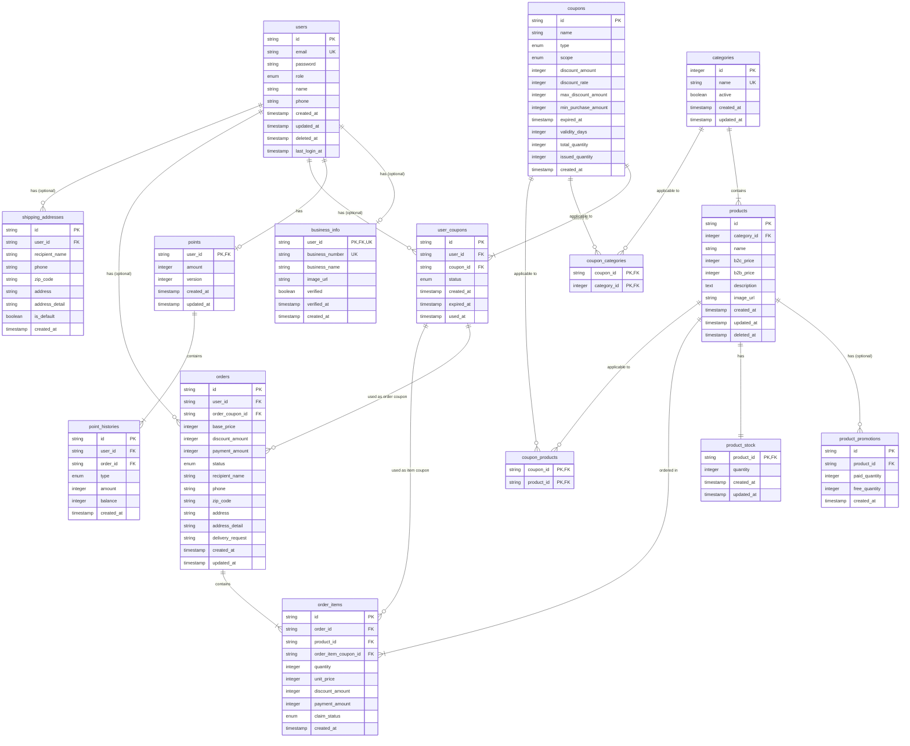

### ERD

```mermaid
erDiagram
    users ||--o| business_info : "has (optional)"
    users ||--o| points : "has"
    users ||--o{ user_coupons : "has (optional)"
    users ||--o{ orders : "has (optional)"
    users ||--o{ shipping_addresses : "has (optional)"

    points ||--|{ point_histories : "contains"

    categories ||--|{ products : "contains"
    categories ||--o{ coupon_categories : "applicable to"

    products ||--o{ product_promotions : "has (optional)"
    products ||--|| product_stock : "has"
    products ||--|{ order_items : "ordered in"
    products ||--o{ coupon_products : "applicable to"

    coupons ||--|{ user_coupons : "issued to"
    coupons ||--o{ coupon_categories : "applicable to"
    coupons ||--o{ coupon_products : "applicable to"

    user_coupons ||--o{ orders : "used as order coupon"
    user_coupons ||--o{ order_items : "used as item coupon"

    orders ||--|{ order_items : "contains"

    users {
        string id PK
        string email UK
        string password
        enum role
        string name
        string phone
        timestamp created_at
        timestamp updated_at
        timestamp deleted_at
        timestamp last_login_at
    }

    business_info {
        string user_id PK,FK,UK
        string business_number UK
        string business_name
        string image_url
        boolean verified
        timestamp verified_at
        timestamp created_at
    }

    points {
        string user_id PK,FK
        integer amount
        integer version
        timestamp created_at
        timestamp updated_at
    }

    point_histories {
        string id PK
        string user_id FK
        string order_id FK
        enum type
        integer amount
        integer balance
        timestamp created_at
    }

    categories {
        integer id PK
        string name UK
        boolean active
        timestamp created_at
        timestamp updated_at
    }

    products {
        string id PK
        integer category_id FK
        string name
        integer b2c_price
        integer b2b_price
        text description
        string image_url
        timestamp created_at
        timestamp updated_at
        timestamp deleted_at
    }

    product_stock {
        string product_id PK,FK
        integer quantity
        timestamp created_at
        timestamp updated_at
    }

    product_promotions {
        string id PK
        string product_id FK
        integer paid_quantity
        integer free_quantity
        timestamp created_at
    }

    coupons {
        string id PK
        string name
        enum type
        enum scope
        integer discount_amount
        integer discount_rate
        integer max_discount_amount
        integer min_purchase_amount
        timestamp expired_at
        integer validity_days
        integer total_quantity
        integer issued_quantity
        timestamp created_at
    }

    coupon_categories {
        string coupon_id PK,FK
        integer category_id PK,FK
    }

    coupon_products {
        string coupon_id PK,FK
        string product_id PK,FK
    }

    user_coupons {
        string id PK
        string user_id FK
        string coupon_id FK
        enum status
        timestamp created_at
        timestamp expired_at
        timestamp used_at
    }

    orders {
        string id PK
        string user_id FK
        string order_coupon_id FK
        integer base_price
        integer discount_amount
        integer payment_amount
        enum status
        string recipient_name
        string phone
        string zip_code
        string address
        string address_detail
        string delivery_request
        timestamp created_at
        timestamp updated_at
    }

    order_items {
        string id PK
        string order_id FK
        string product_id FK
        string order_item_coupon_id FK
        integer quantity
        integer unit_price
        integer discount_amount
        integer payment_amount
        enum claim_status
        timestamp created_at
    }

    shipping_addresses {
        string id PK
        string user_id FK
        string recipient_name
        string phone
        string zip_code
        string address
        string address_detail
        boolean is_default
        timestamp created_at
    }

```
