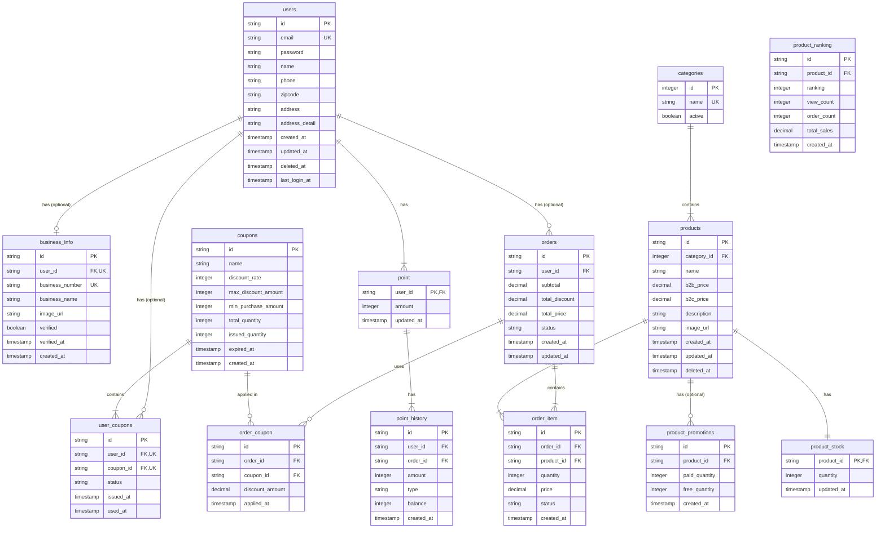

### ERD

```mermaid
erDiagram
  users ||--o| business_Info :"has (optional)"
  categories ||--|{ products : "contains"
  products ||--o{ product_promotions : "has (optional)"
  products ||--|| product_stock : "has"
  users ||--o{ user_coupons : "has (optional)"
  coupons ||--|{ user_coupons : "contains"
  users ||--o{ orders : "has (optional)"
  orders ||--|{ order_item : "contains"
  products ||--|{ order_item : "contains"
  orders ||--o{ order_coupon : "uses"
  coupons ||--o{ order_coupon : "applied in"
  users ||--|{ point : "has"
  point ||--|{ point_history : "has"

  users {
    string id PK
    string email UK
    string password
    string name
    string phone
    string zipcode
    string address
    string address_detail
    timestamp created_at
    timestamp updated_at
    timestamp deleted_at
    timestamp last_login_at
  }

  point {
    string user_id PK, FK
    integer amount
    timestamp updated_at
  }

  point_history {
    string id PK
    string user_id FK
    string order_id FK
    integer amount
    string type
    integer balance
    timestamp created_at
  }

  business_Info {
    string id PK
    string user_id FK, UK
    string business_number UK
    string business_name
    string image_url
    boolean verified
    timestamp verified_at
    timestamp created_at
  }

  categories {
    integer id PK
    string name UK
    boolean active
  }

  products {
    string id PK
    integer category_id FK
    string name
    decimal b2b_price
    decimal b2c_price
    string description
    string image_url
    timestamp created_at
    timestamp updated_at
    timestamp deleted_at
  }

  product_stock {
    string product_id PK, FK
    integer quantity
    timestamp updated_at
  }

  product_promotions {
    string id PK
    string product_id FK
    integer paid_quantity
    integer free_quantity
    timestamp created_at
  }

  product_ranking {
    string id PK
    string product_id FK
    integer ranking
    integer view_count
    integer order_count
    decimal total_sales
    timestamp created_at
  }

  coupons {
    string id PK
    string name
    integer discount_rate
    integer max_discount_amount
    integer min_purchase_amount
    integer total_quantity
    integer issued_quantity
    timestamp expired_at
    timestamp created_at
  }

  user_coupons {
    string id PK
    string user_id FK, UK
    string coupon_id FK, UK
    string status
    timestamp issued_at
    timestamp used_at
  }

  orders {
    string id PK
    string user_id FK
    decimal subtotal
    decimal total_discount
    decimal total_price
    string status
    timestamp created_at
    timestamp updated_at
  }

  order_coupon {
    string id PK
    string order_id FK
    string coupon_id FK
    decimal discount_amount
    timestamp applied_at
  }

  order_item {
    string id PK
    string order_id FK
    string product_id FK
    integer quantity
    decimal price
    string status
    timestamp created_at
  }

```
