```
cmd + shift + v : 미리보기
```

# Use Case Diagrams

## 1. 시스템 (Cron/Queue)

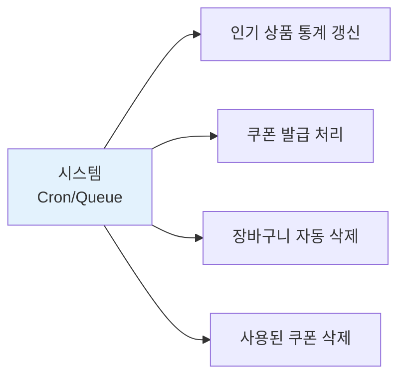

## 2. 관리자

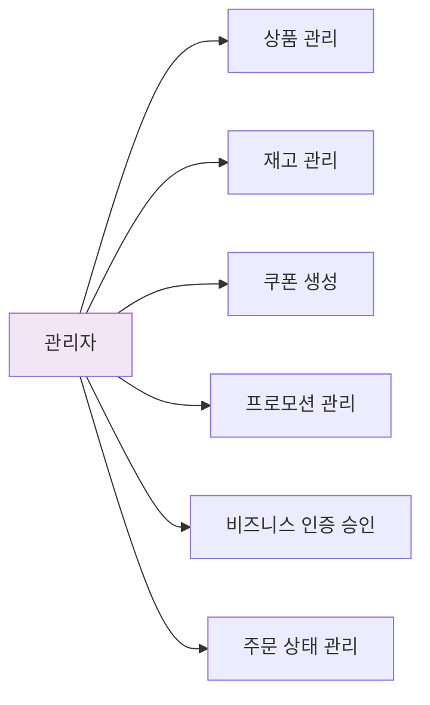

## 3. 소매 고객 (B2C)

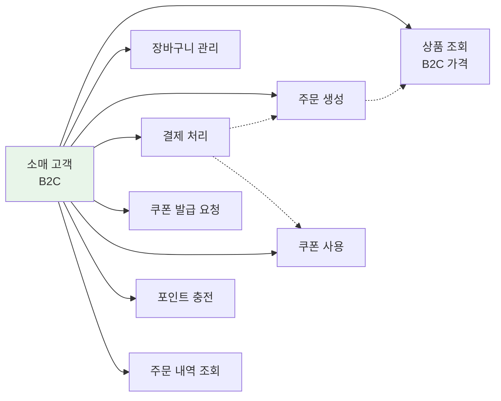

## 4. 도매 고객 (B2B)

### 4-1. 비즈니스 인증 대기 중

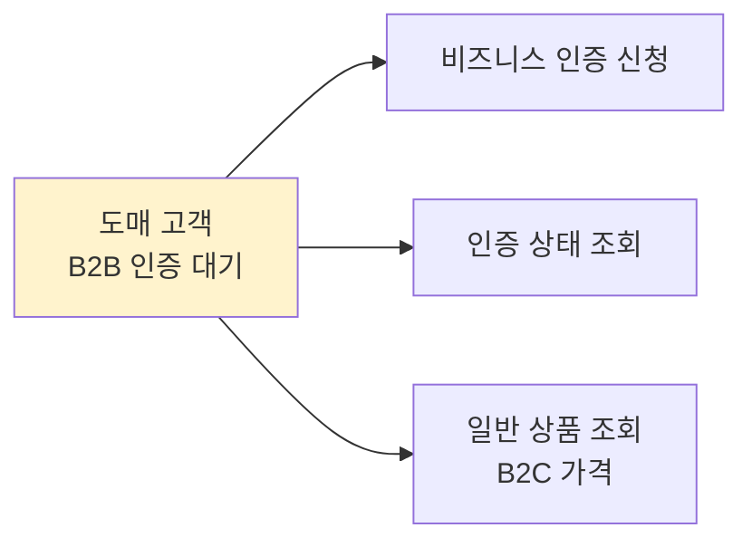

### 4-2. 비즈니스 인증 완료

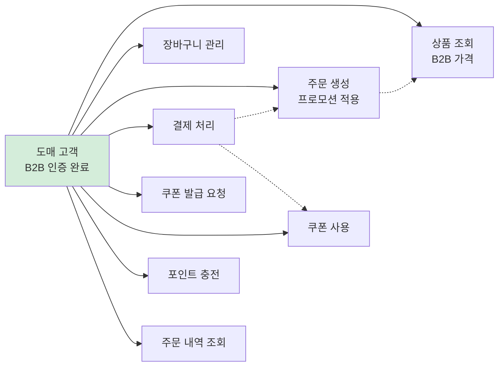

# Sequence Diagrams

## 1. 쿠폰 선착순 발급 (작업 큐 기반)

### 1-1. 성공 케이스

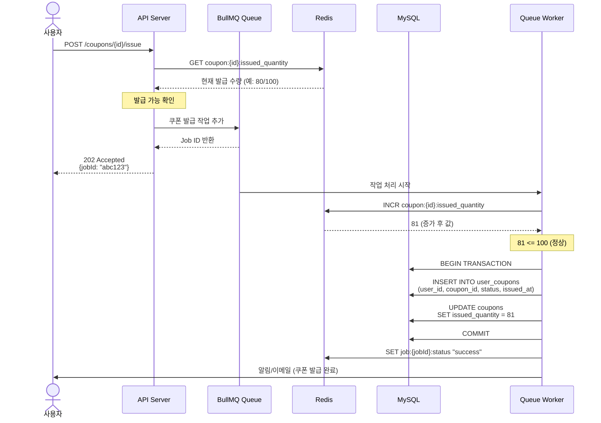

### 1-2. 실패 케이스

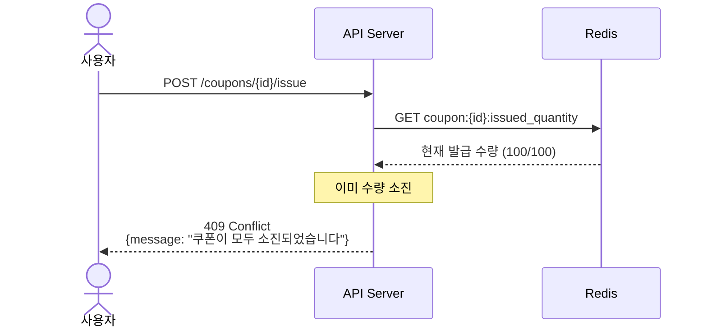

## 2. 장바구니 조회 (웹/앱 동기화)

### 2-1. 저장된 장바구니가 있는 경우

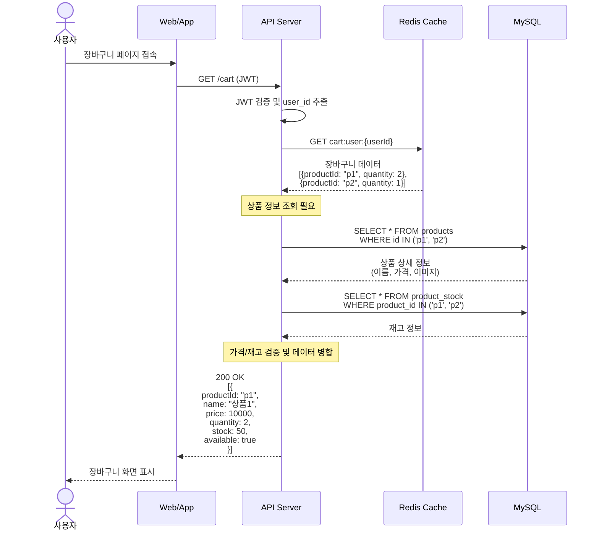

### 2-2. 저장된 장바구니가 없는 경우

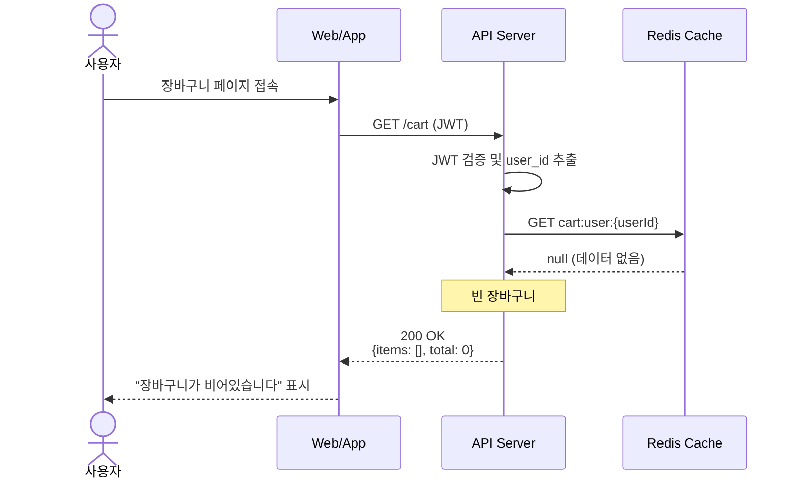

### 2-3. 장바구니에 상품 추가

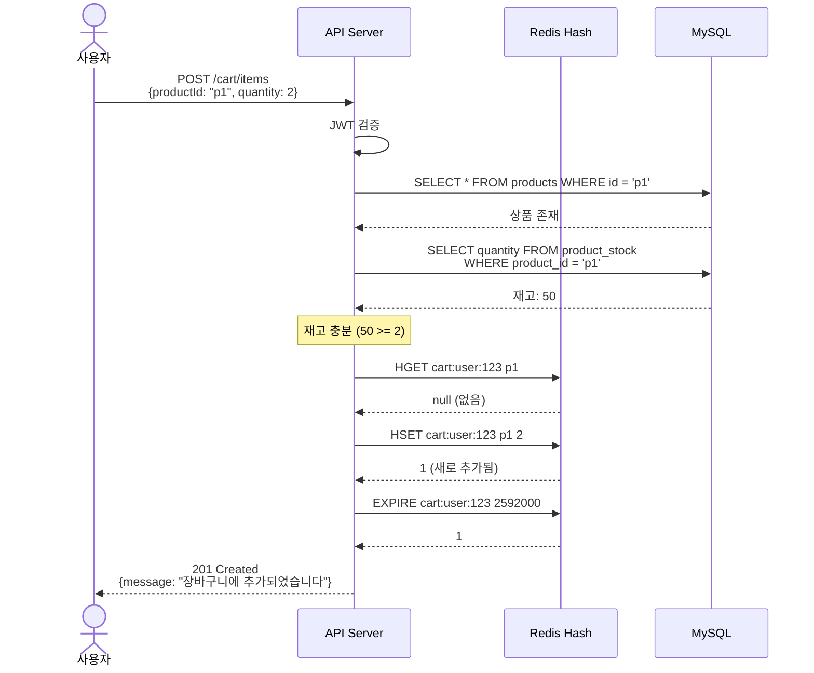

### 2-4. 수량 변경

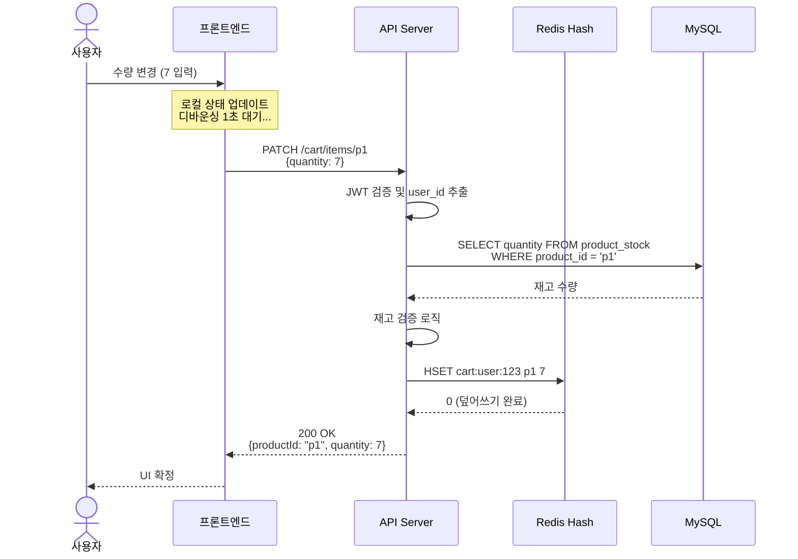

#### 2-4-1. 재고 검증 로직 flow

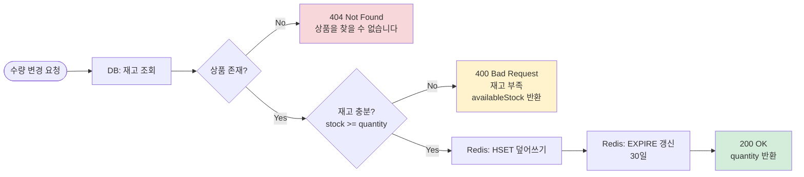

### 2-5. 상품 삭제

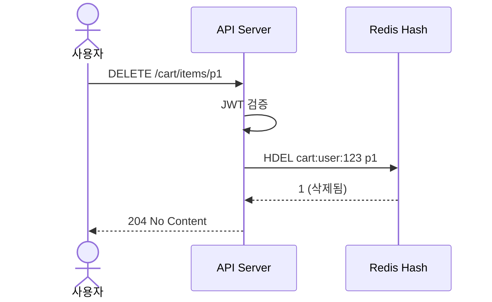

## 3. 주문 과정 Flow

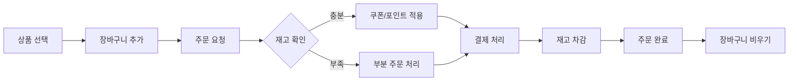

## 4. 쿠폰 발급 Flow

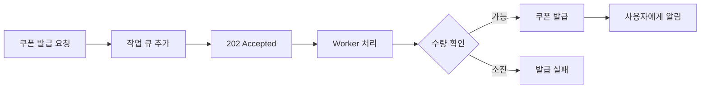

## 5. 결제 처리 Flow

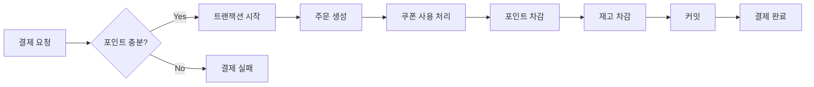
